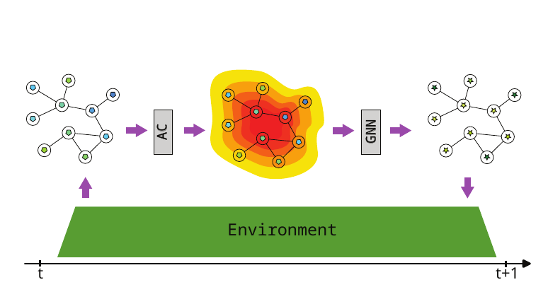
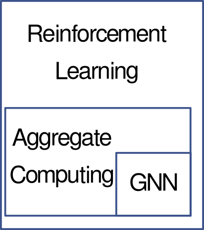
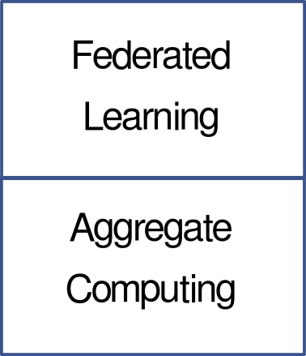

+++
title = "Introduction to my research area"
outputs = ["Reveal"]
+++

# Overview on my research area

---

# Brief introduction

- 2nd year PhD Student from `University of Bologna` (`UNIBO`)
- Supervisor: 
 [Danilo Pianini](https://www.unibo.it/sitoweb/danilo.pianini/en)
- Research group: `Pervasive Computing`

---

## Some faces and topics we are currently working on


---

## What am I into


<div class="overlay">
  <div class="circle-1">
  </div>
  <div class="circle-2">
  </div>
  <div class="circle-3">
  </div>
  <div class="circle-4">
  </div>
</div>

</circles>

---

## Industry

- Active collaboration with the italian industry `SCM Group` that operates worldwide
- Project: automation for software updates in the context of industrial woodworking machines
  
  where:
  - heterogeneous devices
  - globally distributed devices
  - business-critical machines 

- Main skills: 
  * `Software updates` 
  * `Autonomous pipelines` 
  * `Containerization` 
  * `Virtualization` 
  * `Hypervisors`

---

## Deployment

- Experimenting ways to easily manage several heterogeneous devices and use their resources
- Two clusters offered to run experiments for both *students* and *researchers*:
  * AlmaAI cluster
  * Area 4.0 cluster
- **Managed from researchers for researchers**
- Main skills: 
  * `Container orchestration` (`Docker` and `Kubernetes`)
  * `Virtualization` 
  * `Network configuration` 
  * `Network file system`
  * `Clustered storage`

<br />
<br />

<div>
<small style="text-align: left"> 
[*] Baiardi M., Ciatto G., Pianini D. - Infrastructures for the Edge-Cloud Continuum on a Small Scale: A Practical Case Study. ACSOS-C 2023
</small>
</div>

---

## Conceptualization & Tools


- `Macroprogramming / Aggregate Computing`: Controlling multiple devices/entities at once using `space` and `time`. 
  
  Languages, cronologically:
  - `Protelis`[1]: stand-alone language, not longer evolved but still maintained.
  - `Scafi`[2]: a Scala Domain-Specific Language (DSL)
  - `Collektive`[3]: a Kotlin Multi-platform DSL
- `BDI Agent-Oriented Programming` 
  - `JaKtA`[4]: my master thesis, a Kotlin DSL implementation for modelling `BDI` agents.
- `Simulation`
  - `Alchemist`[5]: a simulator for pervasive computing, inspired from chemistry reactions.

<br />
<br />

<div>
<small style="text-align: left">

[1] [https://github.com/Protelis/Protelis](https://github.com/Protelis/Protelis) <br/>
[2] [https://github.com/scafi/scafi](https://github.com/scafi/scafi)<br/>
[3] [https://github.com/Collektive/collektive](https://github.com/Collektive/collektive)<br/>
[4] [https://github.com/jakta-bdi/jakta](https://github.com/jakta-bdi/jakta)<br/>
[5] [https://github.com/AlchemistSimulator/Alchemist](https://github.com/AlchemistSimulator/Alchemist)<br/>

</small>
</div>

---

## Aggregate vs BDI Agents

- Same purpose: a way for representing entities adhering to (some) Autonomic Computing principles
  - ... but different scopes

- `Aggregate Computing` is for representing elements in the environment which exhibit a `collective` behaviour.

- `BDI Multi-Agent Programming` is for representing each entity in an environment using a well-known framework (`AgentSpeak(L)`), inspired from human mental process.
  - **This is more my expertise area**

---

## Conceptualization strengths

- A good way to describe the problem allows to explore different perspectives of it.


---

# Aggregate Applications Examples 

---

### Aggregate Swarm simulations


<div>
<small style="text-align: left"> 

[source: [https://github.com/scafi/macro-swarm](https://github.com/scafi/macro-swarm) 
]

</small>
</div>

---

### Reinforcement Learning using Aggregate Models

{}{}





{}{}

<div class="text-center">



</div>

- `Aggregate` is used to enhance agents' state during reinforcement learning
- The information is obtained through the adoption of a `Graph Neural Network` in this paper.


{}{}


<small style="text-align: left"> 
[*] Gianluca Aguzzi, Mirko Viroli, Lukas Esterle: Field-informed Reinforcement Learning of Collective Tasks with Graph Neural Networks. (2023) <br />
</small>

---

### Federated Learning using Aggregate Models

{}{}

<div class="text-center">



</div>


{}{}

- `Aggregate` is used to distribute the computation
- I don't know a lot of details, this is a work in progress...


{}{}

 ---


# How do I choose among these representation?
## Let's start from an example

---

## Distributed Applications
#### Running on unknown network topologies

<br/>





---

#### May be subject to unpredictable connectivity failures

<br />



---

#### We need *autonomous* entities <br/>capable to *adapt* their behaviour to the failure <br/>and continue to work as expected 
<br />



---

## *Here lies the first difference*

Viewing system interactions in terms of:

{}{}

information propagating through <br/> collectives of devices

<i class="fa-solid fa-arrow-down"></i>

`Aggregate Computing`

{}{}

individual devices with different interactions <br/> with their peers in the environment

<i class="fa-solid fa-arrow-down"></i>

`Multi-Agent Systems`

{}{}

---

## Agents

<br />



---

# Agent-Oriented Programming

<br />




<small>[1] Weiss, Gerhard, Multiagent Systems. MIT Press, 2013</small>

---

# Agent-Oriented Programming

<br />



<small>[1] Weiss, Gerhard, Multiagent Systems. MIT Press, 2013</small>

---


# BDI?

## Beliefs, Desires, Intentions

<br />

- It's a framework to model Multi-Agent Systems through *Goals*
- Reduces the *abstraction gap* between *cognitive abstractions* and the abstractions of common paradigms
  - Mimicking human-level notions such as *beliefs*, *desires* and *intentions*

### three main abstractions:

- *Beliefs*: mental state of the agent, that changes over time.
- *Desires*: motivational state of the system.
- *Intentions*: deliberative state of the agent.

<div>
<br />

<small style="text-align: left"> 
[1] Bratman, Michael. "Intention, plans, and practical reason." (1987) <br />
[2] Anand S. Rao and Michael P. Georgeff. "BDI agents: From theory to practice." (1995) <br />
[3] Anand S. Rao. "Agentspeak(l): BDI agents speak out in a logical computable language." (1996) 
</small>
</div>


---

# AgentSpeak(L)





---

<!-- # BDI Agent Programming Languages

<br />



<br />

<div>
<small style="text-align: left"> 
[1] Collier, R.W., Russell, S.E., Lillis, D.. "Reflecting on agent programming with AgentSpeak(L). I" (2015) <br />
[2] Hindriks, K.V.. "Programming rational agents in GOAL." (2009) <br />
[3] Pokahr, A., Braubach, L., Lamersdorf, W.. "Jadex: A BDI reasoning engine." (2005) <br />
[4] Bordini, R.H., Hübner, J.F., Wooldridge, M.J.. "Programming Multi-Agent Systems in AgentSpeak using Jason." (2007) <br />
[5] D’Urso, F., Longo, C.F., Santoro, C.. "Programming intelligent iot systems with a python-based declarative tool." (2019) <br />
[6] Palanca, J., Rincon, J.A., Carrascosa, C., Julián, V., Terrasa, A.. "A flexible agent architecture in SPADE." (2022)
</small>
</div> 

---

## Jakta: multi-paradigm AOP/BDI+OOP+FP


```kotlin
mas {                                                   // BDI specification
  fun allPlayers(team: String) =
    Regex("""<a\s(\X*?)\sdata-cy="player">(.*)<\/a>""") // Object-oriented regex library
        .findAll(URL("https://www.besoccer.com/team/squad/$team").readText())
        .map { team to it.groupValues[2] }              // Lambda expression (Functional style)

  listOf("napoli", "milan", "internazionale")           // Kotlin standard library
      .flatMap(::allPlayers)                            // Higher-order function (Functional style)
      .forEach { (team, player) ->                      // Destructuring declaration
          agent(player) {
              beliefs { fact { squad(team) } }
              goals { achieve(start) }
              plans {
                  +achieve(start) onlyIf { squad(S).fromSelf } then {
                      execute(print("Hello! I play for", S))
                  }
              }
          }
      }
}.start()
```

<i class="fa-solid fa-file-code"></i> [SoccerMas.kt](https://github.com/jakta-bdi/jakta-examples/blob/main/src/main/kotlin/it/unibo/jakta/agents/examples/soccer/SoccerMas.kt) 

---
-->

# ...Simplified
## A lot of similarities with Autonomic Computing MAPE-K cycle

<br/>

{}{}


<div class="mx-5 text-center">

## *<i class="fa-solid fa-arrow-up"></i> MAPE-K* 
Reference <u>model</u> for *Autonomic* and *self-\** systems design. 

</div>

{}{}

<div class="mx-5 text-center">


## *<i class="fa-solid fa-arrow-up"></i> BDI* 
Reference <u>framework</u> (*AgentSpeak(L)*) for *Multi-Agent Systems*. 

</div>

{}{}

<div>
<small style="text-align: left"> 
[*] Baiardi M. - Supporting Autonomic Computing via BDI Tooling. ACSOS-C 2024
</small>
</div>

---
<!-- 
# MAPE-K vs. BDI: Key differences

### Conceptual vs. practical

* **MAPE-K** defines a conceptual model, needs application-specific implementations
    * favors ad-hoc implementations
* **BDI** is typically reified into a practical tool (a language or library)
    * enforces commitment to a technology

### Architectural vs. formal

* **MAPE-K** defines a reasoning architecture and a loop scheme
* **BDI** has been formalised into AgentSpeak(L)
    * Typical implementations adhere to the formal specification

### Simple vs. complex

* **MAPE-K** is simpler
    * can be implemented on a per-application basis
* **BDI** requires complex matching ad plan-selection algorithms
    * hard to build from scratch in a custom fashion

--- -->

# Current project: 
# *JaKtA*

<br />

<div>
<small style="text-align: left"> 
[*] Baiardi, M., Burattini, S., Ciatto, G., & Pianini, D. - Blending BDI Agents with Object-Oriented and Functional Programming with JaKtA. SN Comput. Sci. 5(8): 1003 (2024)

</small>
</div>

---

## Jakta

- **For software engineers**: Multi-paradigm AOP/BDI+OOP+FP BDI Multi-Agent Systems programming framework
- **For research**: Using a single tool to express several types of Distributed systems
- **Key features**: flexibility <i class="fa-solid fa-arrow-right"></i> it allows to plug-in other tools (for example `simulation`) 


---

## Still a work in progress

- It currently offer a framework for BDI agents using a `Prolog` DSL
- Allows the execution of simulation through the `Alchemist` tool

<br />
<br />


## In the future ...

- I am **currently** working on a new version of the tool 
  - to model simplest agents than the AgentSpeak(L) notion (towards MAPE-K)
  - to simplify the modularity of the tool
  - to let agents adopt `aggregate plans` ... seamlessly :)  

---

# Collaboration with CAU
 
---

### TBD