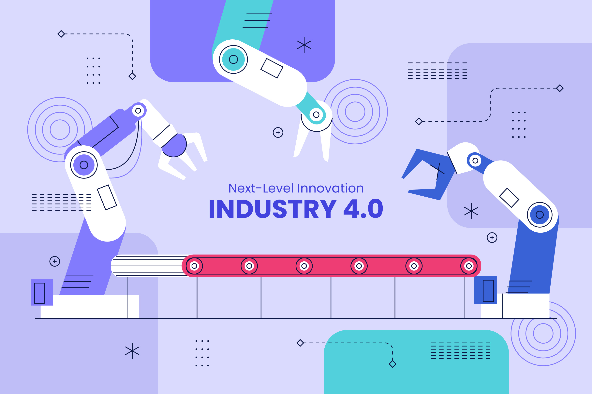
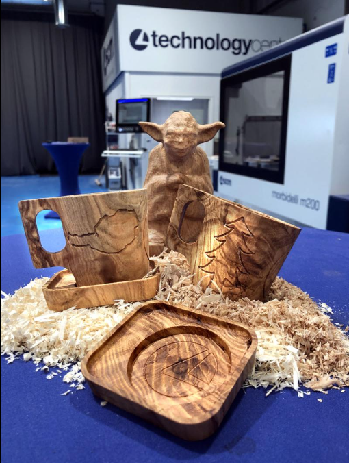
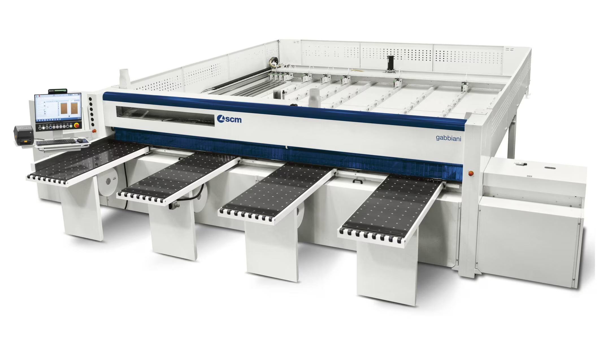

+++
title = "Overview on my research area"
outputs = ["Reveal"]
+++

# Engineering robust software in the Internet of Industrial Things

---

# Context

---

## From the literature

{}
{}

Rapid evolution of software systems: 
* **Internet of Things (IoT)** 
* artificial intelligence techniques 
* adoption of novel development processes
* heterogeneous hardware

{}
{}

{}

{}

{}
{}

---

## Industry 4.0

{}
{}

* Introduction of **Cyber-Physical Systems (CPSs)** in manufacturing production process   **Cyber-Physical Production Systems (CPPSs)**
* Increased software complexity 
* Increasing heterogeneity of devices 

{}

New keyword   **Internet of Industrial Things (IIoT)**

{}

{}
{}

{}
{}

---

## The Internet of Industrial Things

{}
{}

Additional challenges typical of manufacturing systems: 
* Heterogeneity of devices
* Hyper-distribution of data (**Edge-Cloud Continuum**)
* Robustness to faults (**Self-Healing-Fault-Tolerant** techniques)
* Predictive maintenance 
* Role of AI and ML in optimizing manufacturing processes

{}
{}

{}

Seems the perfect fit for SASO systems :)

{}

{}
{}

---

## SASO systems

* *Autonomic Computing* research area
* Aim: Complex and reliable behavior achieved through the interaction of multiple agents
* Achieved through self-management properties:
  * self-configuration
  * self-optimization
  * self-healing
  * self-protection
  * ...
* *MAPE-K* feedback loop to help achieve properties in system implementation

--- 

# Beautiful story or reality ?

---

## From the industry

{}
{}

* Even if promising, applications in the industrial context are limited
* We observed a huge **gap** between the state-of-the-art and the state-of-the-practice in manufacturing software systems

  Filling this gap is the aim of this project

{}
{}

<!--  -->

{}
{}

---

## Industrial case study

* This gap is felt in the industrial environment
* We have an active collaboration with **SCM Group**, a world leader in producing large woodworking machines.

---

## Industrial case study

---

## Industrial case study

* Managing hybrid `Linux` and `Windows` computing environments
* Software maintenance is a challenge due to manual configurations and third-party dependencies
* They need their software system capable to:
  * autonomously update their software systems when newer updates are released
  * finely control the operating system version
  * automatic porting of configuration files between OS/software versions  
  * autonomously act in case of failures during this procedure
  * avoid manual intervention for this process
  * allow software to run on outdated hardware (manufacturing machines have longer lifecycle than software)

---

# Challenges in this case study

* **Deployment**: Managing long-lived industrial hardware while keeping software updated.
Development process is supported by modern techniques (DevOps), but no general tool for deployment.
The deployment process may fails, thus a *rollback* procedure that bring the machine back to the latest working version is required.

* **Heterogeneity**: Handling diverse hardware and software environments across different factories.
Manufacturing software systems must run for a long time, increasing risk that deployment may fail.

* **Dependencies**: Ensuring compatibility between 
  * software versions
  * software and operating system
  * software and dependencies (can be *ranges* of compatibilities) 

* **Critical Environment**: Minimizing downtime and maximize reliability in production environments
  * *dependability* concerns (availability, reliability, maintainability, safety)
  * *security*

---

# Goal

### Reduce the gap between state-of-the-art and state-of-the-practice for
### Developing autonomous, self-updating, and fault-tolerant
### manufacturing software systems

---

# Methodology

---

## How to approach this gap.

Approach:

1. *Top-down*: Enhancing state-of-the-art SASO systems for adoption in industrial software

2. *Bottom-up*: Developing SASO systems to face practical problem in manufacturing

---

# Preliminary results 

---

## The big picture

{}
{}

**Published**

*Workshop*:
* Pianini D., et. al. (2024). Multi-Paradigm Integration for the BDI Resurgence. 2024 IEEE International Conference on Autonomic Computing and Self-Organizing Systems Companion (ACSOS-C), Aarhus, Denmark, 2024
* Baiardi M., et. al. (2024). On the External Concurrency of Current BDI Frameworks for MAS. In: Engineering Multi-Agent Systems. EMAS 2024. 
* Baiardi M., et. al. (2023). Infrastructures for the Edge-Cloud Continuum on a Small Scale: A Practical Case Study. 2023 IEEE International Conference on Autonomic Computing and Self-Organizing Systems Companion (ACSOS-C), Toronto, ON, Canada, 2023

*Doctoral Symposium*:
* Baiardi M. (2024). Supporting Autonomic Computing via BDI Tooling. 2024 IEEE International Conference on Autonomic Computing and Self-Organizing Systems Companion (ACSOS-C), Aarhus, Denmark, 2024
* Baiardi, M. (2023). A Step Forward to Widespread BDI AOP: JaKtA. In: Multi-Agent Systems. EUMAS 2023

*Main Conference*:
* Grushchak D., et al. (2024). Decentralized Multi-Drone Coordination for Wildlife Video Acquisition. 2024 IEEE International Conference on Autonomic Computing and Self-Organizing Systems (ACSOS), Aarhus, Denmark, 2024
* Baiardi M., et. al. (2024). Concurrency Model of BDI Programming Frameworks: Why Should We Control It? In Proceedings of the 23rd International Conference on Autonomous Agents and Multiagent Systems (AAMAS '24)
* Baiardi M., et. al. (2023). JaKtA: BDI Agent-Oriented Programming in Pure Kotlin. In: Multi-Agent Systems. EUMAS 2023

*Journal*:
* Baiardi, M., et al. (2024). Blending BDI Agents with Object-Oriented and Functional Programming with JaKtA. SN COMPUT. SCI.

{}
{}

**Accepted**

*Doctoral Symposium*:
* Baiardi, M. (2024). Validation of BDI MASs via Simulation. 2024 IEEE/ACM 28th International Symposium on Distributed Simulation and Real Time Applications (DS-RT)

**Under review**

*Conference*:
* Aguzzi G., et. al. (2025). A Demonstrator Toolchain for Self-organizing Robot Teams. In: Coordination Models and Languages.
* Baiardi M., et. al. (2025). Self-healing long-term maintenance of large-scale manufacturing machines. 

*Book chapter*:
* Baiardi M., et. al. (2025). JaKtA: Better Tools for a Mainstream BDI. In: Agent Toolkits: Yesterday, Today and Tomorrow

*Journal*:
* Baiardi M., et al. (2025). Using Discrete Event Simulation to Test BDI Systems Before Deployment. In: Auton. Agents Multi Agent Syst.

{}
{}

---

## Top-down: SASO programming frameworks

SASO Systems   Autonomic Computing   MAPE-K general loop
* No standard implementations for MAPE-K
* No programming framework to adopt it

A different agent-base approach coming from a neighboring community goes the opposite direction
* formal abstract semantics definition for their loop
* several programming frameworks and languages available to adopt its

  **Beliefs, Desires, Intentions (BDI) MAS**

<small>---  
[1] Pianini D., et. al. (2024). Multi-Paradigm Integration for the BDI Resurgence. 2024 IEEE International Conference on Autonomic Computing and Self-Organizing Systems Companion (ACSOS-C), Aarhus, Denmark, 2024  
[2] Baiardi M. (2024). Supporting Autonomic Computing via BDI Tooling. 2024 IEEE International Conference on Autonomic Computing and Self-Organizing Systems Companion (ACSOS-C), Aarhus, Denmark, 2024

</small>

---

### BDI

* Multi-Agent systems community
* Terms originally introduced by philosopher Michael Bratman to describe human-based decision making
* **Procedural Reasoning System** general loop
* **AgentSpeak(L)** abstract semantics
* Several language implementations available

Agents are describes through:
* **Beliefs**: knowledge of the agent about the environment
* **Desires**: goals the agent pursues
* **Intentions**: (not explicit) intentional state of the agents, actions he is committed to down
* **Plans**: set of tasks the agent is capable to down

---

## Do you see now the similarities? 

**Why not take BDI as implementation framework for SASO systems**

<small>---  
[1] Pianini D., et. al. (2024). Multi-Paradigm Integration for the BDI Resurgence. 2024 IEEE International Conference on Autonomic Computing and Self-Organizing Systems Companion (ACSOS-C), Aarhus, Denmark, 2024  
[2] Baiardi M. (2024). Supporting Autonomic Computing via BDI Tooling. 2024 IEEE International Conference on Autonomic Computing and Self-Organizing Systems Companion (ACSOS-C), Aarhus, Denmark, 2024

</small>

---

## Top-down: BDI as a programming framework for SASO systems

* we investigated the reasons why BDI frameworks are not considered viable for implementing SASO systems
* we understood that the available technologies were not sufficiently suitable to satisfy today's needs.

---

Reasons:
1. Learning curve vs. Ergonomics
2. Development Tooling
3. Middleware/Runtime Requirements
4. Concurrency model

<small>---  
[3] Baiardi, M. (2023). A Step Forward to Widespread BDI AOP: JaKtA. In: Multi-Agent Systems. EUMAS 2023  
[4] Baiardi M., et. al. (2023). JaKtA: BDI Agent-Oriented Programming in Pure Kotlin. In: Multi-Agent Systems. EUMAS 2023
</small>

---

## Top-down: A novel BDI framework for SASO systems

Development of JaKtA, a BDI (Beliefs-Desires-Intentions) Multi-Agent System framework

Reduce developers' barriers to learning the BDI paradigm by:
* Providing BDI abstractions to a large community of developers with
* Offering an ergonomy akin to the one of a dedicated programming language (Kotlin internal DSL)
* Inheriting the existing tooling of Kotlin
* Multiplatform compilation using a single and shared code base;
* Decoupling BDI entities' definition from their execution. 

<small>---  
[5] Baiardi, M., et al. (2024). Blending BDI Agents with Object-Oriented and Functional Programming with JaKtA. SN COMPUT. SCI.
</small>

---

## Top-down: Concurrency management for BDI systems
* concurrency management is crucial when dealing with heterogeneous manufacturing systems
* state-of-the-art BDI tooling hides these decisions under their implementations
*   we identified this lack in the BDI toolings [6]
*   we defined *external* concurrency in BDI frameworks [6,7]
*   we classified available tools upon this definition [7]

<small>---  
[6] Baiardi M., et. al. (2024). On the External Concurrency of Current BDI Frameworks for MAS. In: Engineering Multi-Agent Systems. EMAS 2024.  
[7] Baiardi M., et. al. (2024). Concurrency Model of BDI Programming Frameworks: Why Should We Control It? In Proceedings of the 23rd International Conference on Autonomous Agents and Multiagent Systems (AAMAS '24)
</small>

---

## Top-down: Simulation as a validation tool for BDI systems

* Manufacturing SASO systems are running in non-deterministic environments 
* a way to correctly identify runtime issues ahead of deployment is fundamental
*   Simulation-based validation for real-time distributed systems
*   Evaluation of existing options for simulating BDI systems
*   Evaluated all possible mappings between DES events and BDI events

<small>---  
[8] Baiardi, M. (2024). Validation of BDI MASs via Simulation. 2024 IEEE/ACM 28th International Symposium on Distributed Simulation and Real Time Applications (DS-RT)  
[9] Baiardi M., et al. (2025). Using Discrete Event Simulation to Test BDI Systems Before Deployment. In: Auton. Agents Multi Agent Syst.

</small>

--- 

## Bottom-up: SASO update system requirements definition

1. **One update system for all subsystems**:  the update system should centrally manage all software updates for the machine (including OS).
2. **Software Validation**: A new level of testing introduced directly on the target machine.
3. **Multi-source Retrieval**: Different machines, different network configurations
4. **Rollback-restore mechanisms**: Automatic detection and management of failures that occur while a software bundle is being installed
5. **Downgrade-restore mechanisms**: reverting the system to a previous working state after a successful upgrade
6. **Containerization and virtualization**: to ease dependencies versions management
7. **Configurability**: the update system must adapt to the destination industrial environment business process

---

## Bottom-up: SASO Deployment lifecycle for manufacturing software systems

---

## Bottom-up: Patent

* Even though the development process of the update system is still ongoing
* Italian National Patent (nr. S3196I-12IT3) entitled   "Metodo per installare una pluralità di software dipendenti in una macchina".

---

# Roadmap

---

## Top-down: Logic-free JaKtA

* BDI programming frameworks are often associated with Logic Programming 
* Logic programming never gained the popularity of other languages
* BDI model is general enough to define agents without rely on logical inference
* Investigating if separating Logic Programming from BDI frameworks would ease their adoption is worth a try 

---

## Top-down: Autonomic BDI

* More generic reasoning cycle towards integrating BDI and AC
* Detaching Logic Programming from BDI framework is propaedeutic to this
* In the future our framework would become an extensible and modular engine on which multiple autonomous entities can be modeled 

---

## Top-down: Macroprogramming BDI

* Create a MAS composed of individuals, that at certain point require to compute something as-a-whole, from the *collective* perspective of all devices.
* Some investigations were previously made in the literature, with the notion of _aggregate plans_ for MASs
* **Aggregate Computing** / **Organic Computing** research area

---

## Bottom-down: Virtualization

* Enhancing software deployment automation via virtualization and containerization
* finely manage the Os versions installations
* currently evaluating **hypervisors** performance for this task.

---

## Bottom-up: Experiments

* Industry is *finally* testing our system proposal
* Collect information about the improvement of their release and deployment process 

--- 

# Conclusion

* Self-Healing-Fault-Tolerant techniques are fundamental for manufacturing software systems
* Still dealing on how to bridge the two branches under investigation

