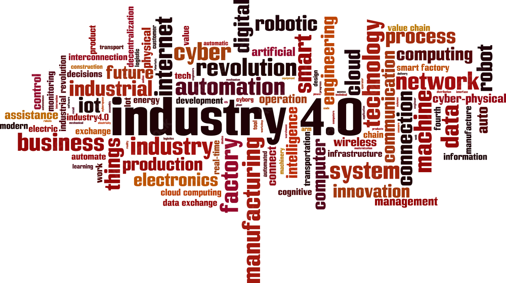

+++
title = "Cognitive Agents in the Field"
outputs = ["Reveal"]
+++

# Cognitive Agents in the Field: 
# an Hybrid Approach Between Agent-Oriented and Aggregate Computation

---

## Context: Autonomous Systems

{}
{}

* Increasingly present in our lives: drones, self-driving cars, autonomous navigation, smart cities.
* The challenge is to **model** both the behavior of **individual agents** (equipped with goals and decision-making abilities) 
and the emergent **collective phenomena** that arise from the interaction of many agents. 

{}
{}

<!--  -->

{}
{}

---

## Model abstractions 

{}
{}

Two main approaches, 
developed in different research areas, 
are particularly useful in this context:

* **BDI Agents (Belief–Desire–Intention)**: model cognitive agents with decision-making capabilities, 
defining their knowledge (*beliefs*), the goals to be achieved (*desires*), and the set of actions the agent undertakes (*intentions*) to pursue those goals.

* **Aggregate Computing**: models the collective behavior of large distributed systems, treating many agents as if they were a single coordinated organism.

{}
{}

{}
{}

<small>---  
[1] Pianini D., et. al. (2024). Multi-Paradigm Integration for the BDI Resurgence. 2024 IEEE International Conference on Autonomic Computing and Self-Organizing Systems Companion (ACSOS-C), Aarhus, Denmark, 2024  
[2] Baiardi M. (2024). Supporting Autonomic Computing via BDI Tooling. 2024 IEEE International Conference on Autonomic Computing and Self-Organizing Systems Companion (ACSOS-C), Aarhus, Denmark, 2024

</small>

---

## Goals

* Provide a reproducible and intuitive modeling method, which
    - incorporates features of both individual cognitive agents and collective coordination.
    - is useful for use by different scientific communities and for industry.
* Adopt and distribute open-source software tools, to ensure transparent, community-supported, and free platforms.
* Provide a validation tool for the designed multi-agent system before the deployement in critical environments.

---
 
## Approach

Three main phases:

1. **Multi-paradigm BDI**: Integration between the BDI approach and traditional programming paradigms (imperative, functional, object-oriented), in order to make agent modeling more expressive and flexible. This integration is called JaKtA (Jason-like Kotlin Agents), as it was created with the goal of inheriting the syntax of Jason, the most widely used language in BDI agent literature.

2. **Validation of the BDI model through simulation**: Integration with a simulation engine to allow testing of scalability, robustness, and efficiency of systems before deployment. The added value is the validation of the very same code that will later be executed in production, rather than an adapted version designed to run only in simulation.

3. **Unified Cognitive–Collective Framework**: Integration of JaKtA and Collektive (an open-source framework for modeling aggregate systems), with a bidirectional flow of information between the individual and the collective.

---

## Conclusion

Creation of an open-source software platform for developing intelligent and adaptive autonomous systems, 
 with possible applications including:

* *Mobility*: drone fleets for environmental monitoring or deliveries, autonomous driving.
* *Smart city*: dynamic traffic management.
* *Industry 4.0*: industrial machines capable of self-organizing and cooperating within the production line.